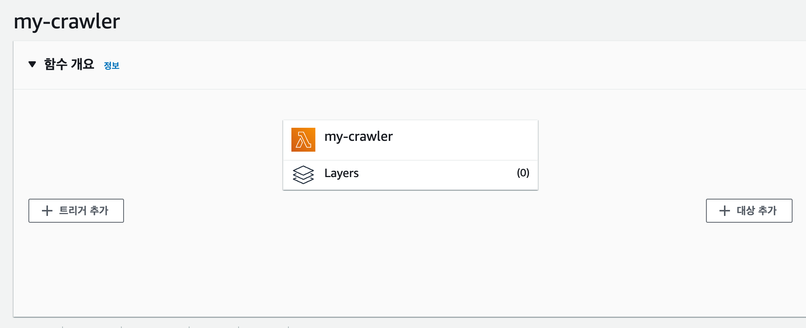

## aws lambda scheduler 를 사용하여 크롤러 자동화 하기


### 1. AWS Lambda 접속하기
```
# region 은 개인이 원하는 곳에 설정하면 된다.
https://ap-northeast-2.console.aws.amazon.com/lambda/home?region=ap-northeast-2#/discover
```

### 2. 계층(layer) 추가하기 
```
# lambda 에는 용량이 큰 파일을 올릴 수 없다. 
# 그러기에 python package 와 chromedriver 와 같은 파일을 layer 형태로 추가해야한다.

# selenium을 이용한 크롤러를 사용하기 위해서 아래 링크에 있는 layer 2개를 모두 추가해준다.
# https://github.com/shindonghwi/aws_lambda_python-crawling/tree/master/layer
```


### 3. 함수 생성하기
```
# 2022-09-28 기준으로 런타임 환경 Python 3.7만 테스트 해보았다.
```


#### 함수 생성 완료된 사진


### 4. 함수에 계층 추가하기
```
# 생성된 함수를 클릭해서 화면 가장 하단으로 내리면 계층 섹션이 보인다.
# 2번에서 생성했던 계층을 보면 ARN 주소 정보가 보인다.
# ARN 지정을 해서 계층에 대한 ARN 주소 정보를 넣고 추가해주자 ( selenium, chromedriver 둘다 적용 )
```


#### 함수에 계층 추가 완료한 사진


### 5. 구성 변경하기
```
# selenium은 구동시키고 크롤링 하는데 시간이 다소 걸린다.
# 그래서 기본적으로 구성되어있는 함수의 셋팅을 변경해야한다.
# 아래 사진처럼 구성-편집을 들어가서 메모리랑 제한 시간 정보를 변경해주고 저장하자.
# 필요하면 다른 값도 변경하면된다.
```
#### 변경전

#### 변경후


### 6. 테스트 코드 실행
```
# 아래 코드를 넣고 Test를 실행하자
# https://github.com/shindonghwi/aws_lambda_python-crawling/blob/master/lambda_function.py
```
#### 테스트전

#### 결과


여기까지하면 lambda 함수 구성은 끝났다.  
이제 크롤러를 자동으로 만들기 위해 AWS EventBridge를 사용한다.
# AWS Event Brigde 
```
# https://ap-northeast-2.console.aws.amazon.com/events/home?region=ap-northeast-2#/rules
```


### 규칙 생성
* 규칙 세부 정보 정의
  * cron을 설정하기 위해서 규칙 유형을 "일정" 으로 선택했다.
  * 
* 일정 정의
  * 매일 8시에 크롤링을 하고싶어서 아래와 같이 셋팅함.
  * 
* 대상 선택
  * 대상은 위에서 생성한 lambda 함수를 선택한다.
  * 
* 태그 구성
  * 태그는 개인이 필요하면 셋팅한다.
* 검토 및 생성
  * 최종 검토 후 문제없으면 규칙을 생성하자.
  * 


### Lambda Service 확인
아래와 같이 정상적으로 EventBridge가 등록이 되면 성공
